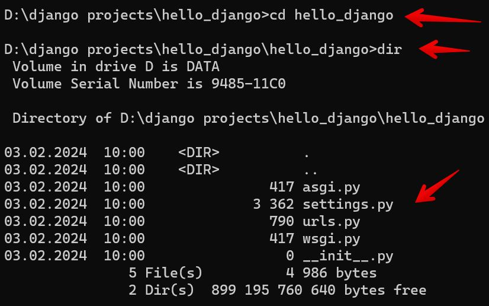

# Първо Django приложение

Django е един от най-мощните и динамични уеб фреймворкове, а правилната основа ще ви помогне да изградите скалируемо и ефективно приложение. Вече знаете как да инсталирате Django, така че нека преминем директно към създаването на вашия проект.

### 1. Създаване на Django проект

След като сте се уверили, че Django е инсталиран, можете да създадете нов проект, като изпълните следната команда в терминала:

```shell
django-admin startproject myproject
```

Заменете **myproject** с желаното име на вашия проект. Тази команда ще създаде нова директория със същото име, съдържаща няколко файла и подпапки. Това са **основните компоненти на вашето Django приложение**, включително конфигурационните файлове, настройките и маршрутите (URLs), които са необходими за стартирането на проекта.

Ако изпълните командата по-горе, няма да получите изход в терминала, но можете да проверите дали всичко е наред, като разгледате структурата на папката. За да направите това, навигирайте до създадената директория с:

```shell
cd myproject
```

След това изпълнете:

```shell {.no-copy}
dir  # За Windows
ls   # За macOS и Linux
```




### 2. Структура на Django проект

След като стартирате нов Django проект, структурата на папките ще изглежда така:

```shell {.no-copy}
myproject/
│── manage.py
│── myproject/
│   ├── __init__.py
│   ├── settings.py
│   ├── urls.py
│   ├── asgi.py
│   ├── wsgi.py
```

Ето кратко описание на основните файлове:

* **manage.py** – Скрипт за управление на Django проекта. Позволява стартиране на сървъра, създаване на миграции, управление на базата данни и други.

* **__init__.py** – Празен файл, който указва на Python, че тази директория е Python пакет.

* **settings.py** – Основните настройки на проекта, включително конфигурацията на базата данни, инсталираните приложения и други.

* **urls.py** – Файл, съдържащ маршрутизацията (URL конфигурацията) на вашия Django сайт.

* **asgi.py и wsgi.py** – Служат като входни точки за ASGI- и WSGI-съвместими уеб сървъри, които ще стартират вашия проект в интернет.


### 3. Django development server – Какво представлява?

За **тестване на Django проекти**, Django разполага с вграден, лек уеб сървър, известен като **development server** (сървър за разработка).

Вграденият сървър на Django е **инструмент, предназначен за разработка**, който улеснява бързото тестване на Django проекти **без да е необходимо да конфигурирате външен уеб сървър**. Основните му характеристики са:

* **Лек и лесен за използване** – няма нужда от допълнителна настройка.
* **Позволява незабавни тестове** – стартира с една команда и веднага можете да преглеждате резултатите.
* **Симулира поведението на продукционен сървър** – но не трябва да се използва за реални уеб приложения, тъй като не осигурява достатъчна сигурност и мащабируемост.

Django уеб сървърът стартира **автоматично**, когато стартирате Django проект. В следващата секция ще научите как да направите това.


### 4. Стартиране на вашия Django проект

След като сте създали своя проект, е време да го стартирате. Навигирайте до директорията на вашия проект в терминала (там, където се намира **manage.py**) и изпълнете следната команда:

```shell
python manage.py runserver
```

Тази команда ще стартира **сървъра за разработка** на вашия локален компютър.

След изпълнението ѝ, ще получите съобщение, което показва, че **сървърът е стартиран успешно**. Сега можете да отворите браузър и да посетите:

```shell
http://127.0.0.1:8000/
```

Ако всичко е наред, ще видите **началната страница на Django**, която потвърждава, че вашият проект работи успешно.


### 5. Спиране на сървъра

За да спрете сървъра, просто натиснете **Ctrl + C** в терминала, където стартирахте приложението.

### 6. Какво представлява адресът 127.0.0.1?

Адресът **127.0.0.1** е **специален IP адрес**, наречен **loopback** или **localhost**. Той означава, че компютърът **комуникира със самия себе си**, без да изпраща данни в интернет.

**Портът 8000 е стандартният порт**, който Django използва. Ако този порт е зает от друга програма, можете да стартирате сървъра на друг порт, например 8080:

```shell
python manage.py runserver 8080
```

Тази команда ще стартира сървъра, но на порт **8080**.


### 7. Django и архитектурният модел MVT

За да разберете как работи Django, трябва да познавате неговата архитектурна структура, която следва **Model-View-Template (MVT)** модела. Това е разновидност на популярния **Model-View-Controller (MVC)** модел.

#### **Каква е разликата между MVC и MVT?**

В **MVC (Model-View-Controller)**:

* **Model** – Представлява структурата на данните и логиката за работа с базата.
* **View** – Отговаря за визуализацията на данните (може да има няколко изгледа за един модел).
* **Controller** – Свързва Model и View, управлявайки бизнес логиката.

В **MVT (Model-View-Template)** на Django:

* **Model** – Отговаря за структурата на базата и обработката на данните.
* **View** – Работи като Controller, като обработва заявките, комуникира с моделите и връща отговори.
* **Template** – Представлява изгледа (View в MVC) – дефинира как ще се показват данните в HTML.

Django **опростява процеса на разработка**, като се абстрахира от **Controller** и комбинира функциите му в **View**. Това води до **по-лесно и ясно разделение между данни, бизнес логика и представяне**.
